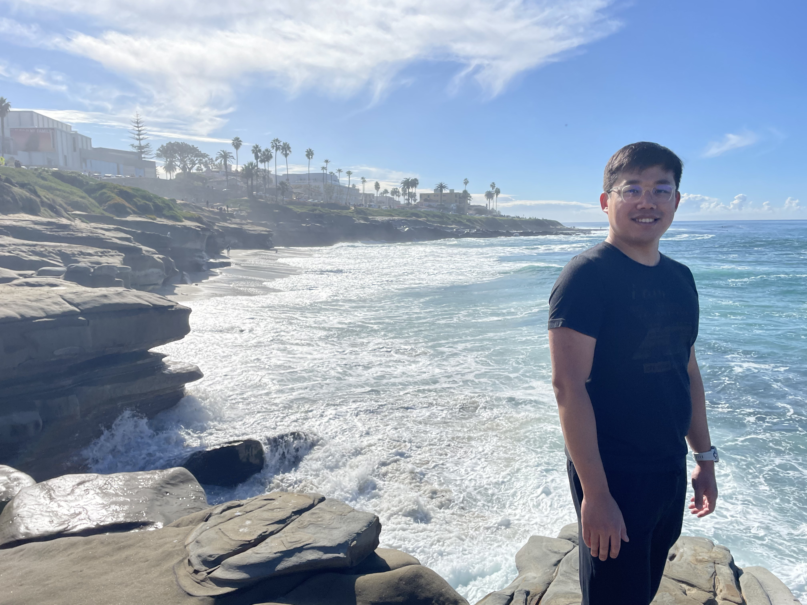

# Yixiang Gao, Ph.D.

    *gradient descending through life* 📈 📉

## About Me
{: style="width: 15rem;"}

I am a Post-Doctoral Research Fellow at Missouri S&T specializing in 
robotics and AI for the mining industry. Under the guidance of 
[Dr. Kwame Awuah-Offei](https://sites.mst.edu/kwame/),
my research is centered on developing autonomous systems for miner 
search and rescue missions. This work integrates several key 
technologies such as 
*Autonomous Navigation*, *Digital Twin*, *Applied AI*.

I earned my Ph.D. from the University of Missouri - Columbia under the
supervision of 
[Dr. Gui DeSouza](https://engineering.missouri.edu/faculty/guilherme-desouza/)
at the 
[ViGIR](http://vigir.missouri.edu/)
lab. 
My doctoral research, supported by the NIH, pioneered machine learning
applications for voice pathology, culminating in publications that 
bridge the fields of engineering and clinical science.

Currently, I am interested in 

* Differentiable Rendering and Simulations 
* Digital Twins 
* Edge AI

that can acceleate the real-world deployment of robotics. I am 
particularly interested in ***On-Device Continual Learning***, which
enables autonomous systems to incrementally acquire new knowledge and
adapt to dynamic environments without cloud dependency.

## Bios

2024 - Current

Post-Doctoral Fellow, Mining and Explosive Engineering
*Missouri University of Science and Technology*

{: style="height: 3rem;" }

2017 - 2024

Ph.D. Electrical and Computer Engineering  
Thesis: Confounded Predictions in Machine Learning  
*University of Missouri - Columbia*

{: style="height: 3rem;" }

2014 - 2017

B.S. Computer Engineering & Electrical Engineering  
*University of Missouri - Columbia*

{: style="height: 3rem;" }

For a detailed overview of my work and experience, please see my full [Curriculum Vitae](assets/YixiangGao_CV.pdf).
