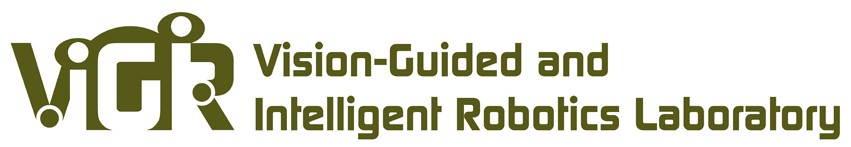

# Yixiang Gao, Ph.D.
*gradient descending through life*

## About Me
{: style="width:25%;"}

I am a Post Doctoral Fellow at Missouri S&T, working with 
[Dr. Kwame Awuah-Offei](https://sites.mst.edu/kwame/) 
on autonomous robot navigation, digital twin, and the application of AI in the mining 
and critical mineral space.

I earned my Ph.D. from the University of Missouri - Columbia under the supervision of 
[Dr. Gui DeSouza](https://engineering.missouri.edu/faculty/guilherme-desouza/)
at the 
[ViGIR](http://vigir.missouri.edu/)
lab. 
My doctoral research, supported by the NIH, pioneered machine learning applications for
voice pathology, culminating in publications that bridge the fields of engineering and 
clinical science.

Currently, I am interested in 
**Edge AI**,
**Digital Twins**, 
and
**Differentiable Simulations** 
that can acceleate the real-world deployment of robotics. I am particularly interested
in on-device continual learning, which enables autonomous systems to incrementally 
acquire new knowledge and adapt to dynamic environments without cloud dependency.

## Bios

### 2024 - Current
Postdoc. Mining and Explosive Engineering    
*Missouri University of Science and Technology*

{: style="height: 3rem; float: right; margin-top: 1rem;" }

### 2017 - 2024
Ph.D. Electrical and Computer Engineering  
Thesis: Confounded Predictions in Machine Learning  
*University of Missouri - Columbia*

{: style="height: 3rem; float: right; margin-top: 1rem;" }

### 2014 - 2017
B.S. Computer Engineering & Electrical Engineering  
*University of Missouri - Columbia*

{: style="height: 3rem; float: right; margin-top: 1rem;" }

For a detailed overview of my work and experience, please see my full [Curriculum Vitae](assets/YixiangGao_CV.pdf).
