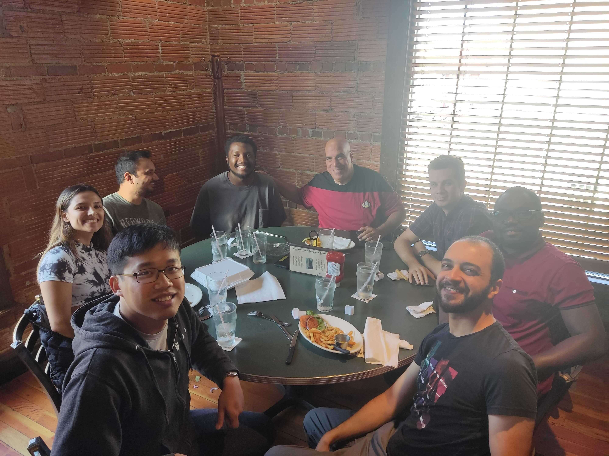

# Yixiang Gao

  
  

    I am a Ph.D candidate from University of Missouri - Columbia under the
    supervision of Dr. Gui DeSouza at Vision-Guided and Intelligent Robotics
    Laboratory. My research is about detect, quantify and mitigate confounding
    factors in machine learning models with a specific focus on the applications
    of voice pathology. However, my research interests include the topic such as
    computer vision, pattern recognition, and robotics etc.
    I am excited about this next generation of AI techonologies like LLMs,
    VLMs, foundation models and I am passionate about building, developmenting
    and understanding them.
  

## Bios ([CV](assets/files/Yixiang_CV.pdf))

### 2017 - Current

**Ph.D. Candidate Electrical and Computer Engineering**

[Vision-Guided and Intelligent Robotics Labotory](http://vigir.missouri.edu/)

University of Missouri - Columbia

**Supervisor:** [Dr. Gui N. DeSouza](https://engineering.missouri.edu/faculty/guilherme-desouza/)

**Research:** AI, Machine Learning, Computer Vision, Robotics, Voice Pathology

**Thesis:** Confounded Predictions in Machine Learning - Detect, quantify and mitigate confounding bias in machine learning applications. From medical predictive models to general deep learning models.

### 2014 - 2017

**B.S. Computer Engineering & B.S. Electrical Engineering**

University of Missouri - Columbia 

## Publications ([Google Scholar](https://scholar.google.com/citations?user=7104qXwAAAAJ&hl=en))

* [COVID-19 detection from pulmonary CT scans using a novel EfficientNet with attention mechanism](https://arxiv.org/abs/2403.11505)

  _The IEEE/CVF Conference on Computer Vision and Pattern Recognition Workshops (CVPRW), 2024_

  _R. Farag, P. Upadhyay, **Y. Gao**, J. Demby's, K. G. Montoya, S. M. Ali Tousi, G. Omotara, G. N. DeSouza_

  [Accepted]

* Voice sEMG classification of sentences for vocal fatigue detection using GA-SVM for confounder

  _13th International Conference on Voice Physiology and Biomechanics (ICVPB), 2024_

  _**Y. Gao**, G. N. DeSouza, M. Berardi, and M. Dietrich_

  [Accepted]

* [Removal of Confounding Factors using GA-SVM Feature Adaptation: Application on Detection of Vocal Fatigue thru sEMG Classification](https://ieeexplore.ieee.org/abstract/document/10253983)

  _IEEE Congress on Evolutionary Computation (CEC), 2023_

  _**Y. Gao**, M. Berardi, M. Dietrich, and G. N. DeSouza_

* Classification of vocal fatigue using neck semg with leave-one-subject-out testing

  _The 14th Advances in Quantitative Laryngology, Voice and Speech Research (AQL), 2021_

  _**Y. Gao**, M. Dietrich, and G. N. DeSouza_

* Explore voice production variability through neck semg clustering - challenge for accurate labeling of vocal fatigue

  _The 14th Advances in Quantitative Laryngology, Voice and Speech Research (AQL), 2021_

  _**Y. Gao**, M. Dietrich, and G. N. DeSouza_

* [Classification of vocal fatigue using sEMG: Data Imbalance, Normalization, and the Role of Vocal Fatigue Index Scores](https://www.mdpi.com/2076-3417/11/10/4335)

  _Applied Sciences, 2021_

  _**Y. Gao**, M. Dietrich, and G. N. DeSouza_

* [Object Detection and Pose Estimation using CNN in Embedded Hardware for Assistive Technology](https://ieeexplore.ieee.org/abstract/document/9002767)

  _IEEE Symposium Series on Computational Intelligence (SSCI), 2019_

  _J. Demby’s, **Y. Gao**, A. Shafiekhani, and G. N. DeSouza_

* [A Study on Solving the Inverse Kinematics of Serial Robots using Artificial Neural Network and Fuzzy Neural Network](http://ieeexplore.ieee.org/stamp/stamp.jsp?tp=&arnumber=8858872&isnumber=8858787)

  _IEEE International Conference on Fuzzy Systems (FUZZ-IEEE), 2019_

  _J. Demby’s, **Y. Gao** and G. N. DeSouza_

* Classification of vocal gestures extracted from quasi-daily sentences to detect vocal fatigue

  _The 13th Advances in Quantitative Laryngology, Voice and Speech Research (AQL), 2019_

  _**Y. Gao**, M. Dietrich, M. Pfeiffier, A. Walker, and G. N. DeSouza_

* [Classification of sEMG Signals for the Detection of Vocal Fatigue based on VFI Scores](http://ieeexplore.ieee.org/stamp/stamp.jsp?tp=&arnumber=8513224&isnumber=8512178)

  _International Conference of the IEEE Engineering in Medicine and Biology Society (EMBC), 2018_

  _**Y. Gao**, M. Dietrich, M. Pfeiffer and G. N. DeSouza_

* Classification of neck surface emg signals for the early detection of vocal dysfunction

  _The 12th Advances in Quantitative Laryngology, Voice and Speech Research (AQL), 2017_

  _**Y. Gao**, M. Pfeiffier, M. Dietrich, and G. N. DeSouza_
